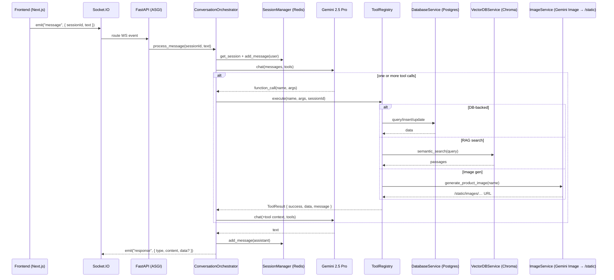

# Ethiopian Horticulture E-commerce Chatbot (MVP)

This repository contains an MVP bilingual chatbot for Ethiopian horticulture e-commerce with dual customer/supplier workflows, a RAG knowledge base, and pricing insights.

Refer to architecture_document.md and implementation_plan.md for full design details.

## Quick Start

- Prerequisites: Docker, Docker Compose, Node.js 20 (for local dev), Python 3.11 (optional)
- Copy `.env.example` to `.env` and fill `GEMINI_API_KEY` if needed later.

Ports note (host): to avoid conflicts, all host ports are incremented by +5 compared to their defaults.
- Frontend: host `3005` -> container `3000`
- Backend: host `8005` -> container `8000`
- Postgres: host `5437` -> container `5432`
- Redis: host `6384` -> container `6379`
- Chroma: host `8006` -> container `8000`

### Run all services

```
docker compose up --build
```

- Frontend: http://localhost:3005
- Backend health: http://localhost:8005/health
- Postgres: localhost:5437
- Redis: localhost:6384
- Chroma: localhost:8006

### Project Structure
```
.
├── backend/
│   ├── app/
│   │   ├── main.py           # FastAPI app with /health
│   │   └── config.py         # Basic settings
│   ├── requirements.txt
│   ├── Dockerfile
│   └── scripts/              # Placeholders for Milestone 2
├── frontend/                 # Next.js 14 (App Router, TS, Tailwind)
│   └── Dockerfile
├── data/
├── docker-compose.yml
├── .env.example
├── .gitignore
├── architecture_document.md
├── implementation_plan.md
├── progress_report.md
└── rules.md
```

## Development Notes
- Follow rules.md for workflow and progress updates.
- Internal service communication uses default container ports and service names (e.g., `postgres:5432`, `redis:6379`, `chroma:8000`).
- Host port offset (+5) is only for local/host access; internal Docker network remains unchanged.

## Testing

Run these inside the backend container to ensure dependencies and services are available.

- Start services and ensure DB + Chroma are ready:
  - `docker compose up -d postgres redis chroma backend`
  - Ingest KB if not already: `docker compose exec backend python -c "from scripts.load_dataset import ingest_knowledge_base; ingest_knowledge_base('/data/product_knowledge_base.csv')"`

- Integration tests (real services, requires `GEMINI_API_KEY`):
  - `docker compose exec backend pytest -vv tests/integration`

- Load tests (concurrent sessions; defaults small; override via env):
  - Fast DB-only mode (default): `docker compose exec -e LOAD_SESSIONS=10 -e LOAD_MSGS=10 backend pytest -q tests/load`
  - Full orchestrator (LLM+RAG, slow): `docker compose exec -e LOAD_MODE=orchestrator -e LOAD_SESSIONS=3 -e LOAD_MSGS=3 backend pytest -q tests/load`
  - Adjust thresholds if needed: `-e LOAD_MAX_P50=120 -e LOAD_MAX_P95=180`

- Unit/Service tests:
  - `docker compose exec backend pytest -vv tests/services`

## Data Validation

- Verify dataset and RAG state:
  - `docker compose exec backend python scripts/validate_data.py`
  - Checks row counts, orphan references, date ranges, and Chroma collection count vs CSV.

## Logging

- Enable detailed logging:
  - In `.env`: `LOG_LEVEL=DEBUG` and optionally `TRACE_TOOLS=1`, `DB_ECHO=1`.
- Enable JSON logs:
  - In `.env`: `LOG_JSON=1` (logs become JSON lines with ts/level/logger/msg).

## Next Steps
- Milestone 2: Database schema, dataset loading, and Chroma initialization.
- Milestone 3: Core backend services (LLM, DB abstraction, RAG, image generation).

## Production (VPS) Run

Production deployment with Docker Compose and host-level Nginx (not in Docker).

1) Prepare env
- Copy `.env.example` to `.env` and set `GEMINI_API_KEY` (and optional flags like `LOG_LEVEL=INFO`).
- Set the frontend public backend URL for build-time (using your domain):
  - `echo NEXT_PUBLIC_BACKEND_URL=https://chipchip.ermiopia.com >> .env`

2) Build and start
- `docker compose -f docker-compose.prod.yml up -d --build`
  - Exposes: frontend on `3005` (container `3000`), backend on `8005` (container `8000`)

3) Configure host Nginx
- Create `/etc/nginx/sites-available/chipchip` that proxies `/` → `127.0.0.1:3005`, `/api` and `/socket.io` → `127.0.0.1:8005`.
- Symlink to `sites-enabled`, test, and reload Nginx.
- See `production_guide.md` for a complete config and steps.

4) Initialize data (first-time only)
- `docker compose -f docker-compose.prod.yml exec backend python scripts/init_db.py`
- `docker compose -f docker-compose.prod.yml exec backend python scripts/load_dataset.py`

5) Access via domain
- `http://chipchip.ermiopia.com` (add TLS later per guide)

Notes
- Generated product images persist in `backend_static` volume (`/app/static`).
- Chroma exposed on host `8001` for troubleshooting.
- Logs: `docker compose -f docker-compose.prod.yml logs -f backend`

## Future Enhancements
- Increase robustness via rigorous testing (unit, integration, load).
- Expand toolset (additional DB queries, supplier/customer ops, analytics).
- Improve prompts (clearer system prompt, tighter tool schemas, evaluation).
- Integrate realtime payment gateway (webhooks + status updates in UI).

## AI Agent Architecture



### How it works

- Single agent: All user messages go straight to Gemini 2.5 Pro; no separate intent router.
- Session + history: Sessions live in Redis. We store up to `MAX_CONVERSATION_HISTORY` (default 20) and send the last 10 messages plus a short preface on each turn.
- Tool loop: Orchestrator runs a bounded tool-calling loop (max 3). When Gemini calls a tool, we execute it, feed the result back as context, and let Gemini finalize.
- Image results: For `generate_product_image`, we return a typed `{ type: "image", data: { url }, content }` payload so the UI renders an image bubble.
- Data integrity: The agent must not fabricate inventory/orders/schedules/prices/quantities; it only states such data after a tool call in the same turn.
- Dates/time: The agent never asks for date ranges. It uses `get_current_time` to resolve “today/this week/next week” and calls `get_supplier_schedule` (defaults to current week if dates omitted).
- Empty replies: The orchestrator prevents blank responses. If tools return nothing, it returns an explicit message (e.g., “No results were returned by the requested operation.”).

### Tools (high level)

- `get_current_time`, `register_user`, `search_products`, `get_pricing_insights`, `generate_product_image`, `rag_query`
- `create_order`, `add_inventory`, `check_supplier_stock`, `get_supplier_schedule`, `suggest_flash_sale`, `get_customer_orders`
